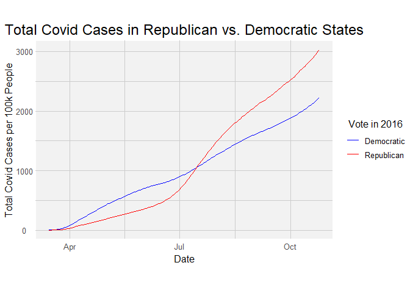

Covid/Political EDA
================

This is an [R Markdown](http://rmarkdown.rstudio.com) Notebook. When you
execute code within the notebook, the results appear beneath the code.

Try executing this chunk by clicking the *Run* button within the chunk
or by placing your cursor inside it and pressing *Ctrl+Shift+Enter*.

``` r
library(tidyverse)
```

    ## -- Attaching packages ----------------------------------------------------------------------------------------------------------------------------------------------------------------------------------------- tidyverse 1.3.0 --

    ## v ggplot2 3.3.2     v purrr   0.3.4
    ## v tibble  3.0.3     v dplyr   1.0.2
    ## v tidyr   1.1.2     v stringr 1.4.0
    ## v readr   1.3.1     v forcats 0.5.0

    ## -- Conflicts -------------------------------------------------------------------------------------------------------------------------------------------------------------------------------------------- tidyverse_conflicts() --
    ## x dplyr::filter() masks stats::filter()
    ## x dplyr::lag()    masks stats::lag()

``` r
political_filepath <- "./data/US_County_Level_Presidential_Results_08-16.csv"
df_pol<- read_csv(political_filepath)
```

    ## Parsed with column specification:
    ## cols(
    ##   fips_code = col_double(),
    ##   county = col_character(),
    ##   total_2008 = col_double(),
    ##   dem_2008 = col_double(),
    ##   gop_2008 = col_double(),
    ##   oth_2008 = col_double(),
    ##   total_2012 = col_double(),
    ##   dem_2012 = col_double(),
    ##   gop_2012 = col_double(),
    ##   oth_2012 = col_double(),
    ##   total_2016 = col_double(),
    ##   dem_2016 = col_double(),
    ##   gop_2016 = col_double(),
    ##   oth_2016 = col_double()
    ## )

``` r
df_pol_sorted <- df_pol %>%
  mutate(fips_code = paste0(0,fips_code)) %>%
  separate(fips_code, into = c("zeros","fips_code"), sep = -5) %>%
  select(fips_code, total_2016, dem_2016, gop_2016, oth_2016) %>%
  arrange(fips_code)
df_pol_sorted
```

    ## # A tibble: 3,112 x 5
    ##    fips_code total_2016 dem_2016 gop_2016 oth_2016
    ##    <chr>          <dbl>    <dbl>    <dbl>    <dbl>
    ##  1 01001          24661     5908    18110      643
    ##  2 01003          94090    18409    72780     2901
    ##  3 01005          10390     4848     5431      111
    ##  4 01007           8748     1874     6733      141
    ##  5 01009          25384     2150    22808      426
    ##  6 01011           4701     3530     1139       32
    ##  7 01013           8685     3716     4891       78
    ##  8 01015          47376    13197    32803     1376
    ##  9 01017          13778     5763     7803      212
    ## 10 01019          10503     1524     8809      170
    ## # ... with 3,102 more rows

``` r
census_filepath <- "./data/ACSDT5Y2018.B01003_data_with_overlays_2020-10-07T194616.csv"
df_pop <- read_csv(census_filepath)
```

    ## Parsed with column specification:
    ## cols(
    ##   id = col_character(),
    ##   `Geographic Area Name` = col_character(),
    ##   `Estimate!!Total` = col_double(),
    ##   `Margin of Error!!Total` = col_character()
    ## )

``` r
df_pop_sorted <- df_pop %>%
  separate(col = id, into = c("id_firstpart", "fips"), sep = -5) %>%
  select('fips', 'Geographic Area Name', 'Estimate!!Total') %>%
  rename("population" = "Estimate!!Total")
df_pop_sorted
```

    ## # A tibble: 3,220 x 3
    ##    fips  `Geographic Area Name`   population
    ##    <chr> <chr>                         <dbl>
    ##  1 01001 Autauga County, Alabama       55200
    ##  2 01003 Baldwin County, Alabama      208107
    ##  3 01005 Barbour County, Alabama       25782
    ##  4 01007 Bibb County, Alabama          22527
    ##  5 01009 Blount County, Alabama        57645
    ##  6 01011 Bullock County, Alabama       10352
    ##  7 01013 Butler County, Alabama        20025
    ##  8 01015 Calhoun County, Alabama      115098
    ##  9 01017 Chambers County, Alabama      33826
    ## 10 01019 Cherokee County, Alabama      25853
    ## # ... with 3,210 more rows

``` r
df_joined <- df_covid %>%
  left_join(df_pop_sorted, by = "fips") %>%
  left_join(df_pol_sorted, by = c("fips" = "fips_code")) %>%
  select(date, fips, county, state, population, cases, deaths, total_2016, dem_2016, gop_2016, oth_2016 )
df_joined
```

    ## # A tibble: 664,147 x 11
    ##    date       fips  county state population cases deaths total_2016 dem_2016
    ##    <date>     <chr> <chr>  <chr>      <dbl> <dbl>  <dbl>      <dbl>    <dbl>
    ##  1 2020-01-21 53061 Snoho~ Wash~     786620     1      0     305281   165740
    ##  2 2020-01-22 53061 Snoho~ Wash~     786620     1      0     305281   165740
    ##  3 2020-01-23 53061 Snoho~ Wash~     786620     1      0     305281   165740
    ##  4 2020-01-24 17031 Cook   Illi~    5223719     1      0    2055215  1528582
    ##  5 2020-01-24 53061 Snoho~ Wash~     786620     1      0     305281   165740
    ##  6 2020-01-25 06059 Orange Cali~    3164182     1      0     830206   413982
    ##  7 2020-01-25 17031 Cook   Illi~    5223719     1      0    2055215  1528582
    ##  8 2020-01-25 53061 Snoho~ Wash~     786620     1      0     305281   165740
    ##  9 2020-01-26 04013 Maric~ Ariz~    4253913     1      0    1201934   549040
    ## 10 2020-01-26 06037 Los A~ Cali~   10098052     1      0    2314275  1654626
    ## # ... with 664,137 more rows, and 2 more variables: gop_2016 <dbl>,
    ## #   oth_2016 <dbl>

``` r
df_normalized <-
  df_joined %>%
  mutate(
    cases_per100k = cases / population * 100000,
    deaths_per100k = deaths / population * 100000
    ) %>%
  mutate(
    per_dem = dem_2016/total_2016*100,
    per_gop = gop_2016/total_2016*100,
    per_oth = oth_2016/total_2016*100,
    per_vote = total_2016/population*100
    ) %>%
  mutate(county_party = if_else(per_gop >= per_dem, "R", "D")) %>%
  drop_na()
df_normalized
```

    ## # A tibble: 638,683 x 18
    ##    date       fips  county state population cases deaths total_2016 dem_2016
    ##    <date>     <chr> <chr>  <chr>      <dbl> <dbl>  <dbl>      <dbl>    <dbl>
    ##  1 2020-01-21 53061 Snoho~ Wash~     786620     1      0     305281   165740
    ##  2 2020-01-22 53061 Snoho~ Wash~     786620     1      0     305281   165740
    ##  3 2020-01-23 53061 Snoho~ Wash~     786620     1      0     305281   165740
    ##  4 2020-01-24 17031 Cook   Illi~    5223719     1      0    2055215  1528582
    ##  5 2020-01-24 53061 Snoho~ Wash~     786620     1      0     305281   165740
    ##  6 2020-01-25 06059 Orange Cali~    3164182     1      0     830206   413982
    ##  7 2020-01-25 17031 Cook   Illi~    5223719     1      0    2055215  1528582
    ##  8 2020-01-25 53061 Snoho~ Wash~     786620     1      0     305281   165740
    ##  9 2020-01-26 04013 Maric~ Ariz~    4253913     1      0    1201934   549040
    ## 10 2020-01-26 06037 Los A~ Cali~   10098052     1      0    2314275  1654626
    ## # ... with 638,673 more rows, and 9 more variables: gop_2016 <dbl>,
    ## #   oth_2016 <dbl>, cases_per100k <dbl>, deaths_per100k <dbl>, per_dem <dbl>,
    ## #   per_gop <dbl>, per_oth <dbl>, per_vote <dbl>, county_party <chr>

``` r
df_state_party <-
  df_normalized %>%
  group_by(state) %>%
  summarize(
    state_tot = sum(total_2016), 
    dem_total = sum(dem_2016), 
    gop_total = sum(gop_2016),
    oth_total = sum(oth_2016),
    per_dem_state = dem_total/state_tot*100,
    per_gop_state = gop_total/state_tot*100,
    per_oth_state = oth_total/state_tot*100,
    per_vote_state = state_tot/population*100) %>%
  mutate(
    state_party = if_else(gop_total >= dem_total, "R","D"),
    state_party_fine = case_when(
      per_gop_state - per_dem_state >=  15 & per_gop_state >= per_dem_state ~ "SR",
      per_gop_state >= per_dem_state ~ "R",
      per_dem_state - per_gop_state >=  15 & per_dem_state >= per_gop_state ~ "SD",
      per_dem_state >= per_gop_state ~ "D",
      #per_dem_state >= 0 ~ "S"
      ),
      state_party_fine = as.factor(state_party_fine)
    )  %>%
 select(state, state_party, state_party_fine) %>%
   distinct() #%>%
```

    ## `summarise()` regrouping output by 'state' (override with `.groups` argument)

``` r
  # mutate(state_party_fine = fct_relevel(state_party_fine, "SD", "D", "R", "SR")) %>%
  # pull(state_party_fine) %>%
  # levels()

 df_state_party
```

    ## # A tibble: 50 x 3
    ## # Groups:   state [50]
    ##    state                state_party state_party_fine
    ##    <chr>                <chr>       <fct>           
    ##  1 Alabama              R           SR              
    ##  2 Arizona              R           R               
    ##  3 Arkansas             R           SR              
    ##  4 California           D           SD              
    ##  5 Colorado             D           D               
    ##  6 Connecticut          D           D               
    ##  7 Delaware             D           D               
    ##  8 District of Columbia D           SD              
    ##  9 Florida              R           R               
    ## 10 Georgia              R           R               
    ## # ... with 40 more rows

``` r
df_norm_state <-
  df_normalized %>%
  left_join(df_state_party, by = "state")
df_norm_state
```

    ## # A tibble: 638,683 x 20
    ##    date       fips  county state population cases deaths total_2016 dem_2016
    ##    <date>     <chr> <chr>  <chr>      <dbl> <dbl>  <dbl>      <dbl>    <dbl>
    ##  1 2020-01-21 53061 Snoho~ Wash~     786620     1      0     305281   165740
    ##  2 2020-01-22 53061 Snoho~ Wash~     786620     1      0     305281   165740
    ##  3 2020-01-23 53061 Snoho~ Wash~     786620     1      0     305281   165740
    ##  4 2020-01-24 17031 Cook   Illi~    5223719     1      0    2055215  1528582
    ##  5 2020-01-24 53061 Snoho~ Wash~     786620     1      0     305281   165740
    ##  6 2020-01-25 06059 Orange Cali~    3164182     1      0     830206   413982
    ##  7 2020-01-25 17031 Cook   Illi~    5223719     1      0    2055215  1528582
    ##  8 2020-01-25 53061 Snoho~ Wash~     786620     1      0     305281   165740
    ##  9 2020-01-26 04013 Maric~ Ariz~    4253913     1      0    1201934   549040
    ## 10 2020-01-26 06037 Los A~ Cali~   10098052     1      0    2314275  1654626
    ## # ... with 638,673 more rows, and 11 more variables: gop_2016 <dbl>,
    ## #   oth_2016 <dbl>, cases_per100k <dbl>, deaths_per100k <dbl>, per_dem <dbl>,
    ## #   per_gop <dbl>, per_oth <dbl>, per_vote <dbl>, county_party <chr>,
    ## #   state_party <chr>, state_party_fine <fct>

``` r
df_normalized_slim <-
  df_norm_state %>%
  select(date, fips, county, state, population, cases, deaths, cases_per100k, deaths_per100k, county_party, state_party, state_party_fine)
df_normalized_slim
```

    ## # A tibble: 638,683 x 12
    ##    date       fips  county state population cases deaths cases_per100k
    ##    <date>     <chr> <chr>  <chr>      <dbl> <dbl>  <dbl>         <dbl>
    ##  1 2020-01-21 53061 Snoho~ Wash~     786620     1      0       0.127  
    ##  2 2020-01-22 53061 Snoho~ Wash~     786620     1      0       0.127  
    ##  3 2020-01-23 53061 Snoho~ Wash~     786620     1      0       0.127  
    ##  4 2020-01-24 17031 Cook   Illi~    5223719     1      0       0.0191 
    ##  5 2020-01-24 53061 Snoho~ Wash~     786620     1      0       0.127  
    ##  6 2020-01-25 06059 Orange Cali~    3164182     1      0       0.0316 
    ##  7 2020-01-25 17031 Cook   Illi~    5223719     1      0       0.0191 
    ##  8 2020-01-25 53061 Snoho~ Wash~     786620     1      0       0.127  
    ##  9 2020-01-26 04013 Maric~ Ariz~    4253913     1      0       0.0235 
    ## 10 2020-01-26 06037 Los A~ Cali~   10098052     1      0       0.00990
    ## # ... with 638,673 more rows, and 4 more variables: deaths_per100k <dbl>,
    ## #   county_party <chr>, state_party <chr>, state_party_fine <fct>

``` r
df_new_cases <-
  df_normalized_slim %>%
  group_by(fips) %>%
  mutate(
    new_cases = cases - lag(cases, default = 0),
    new_cases_per100k = new_cases/population*100000,
    new_deaths = deaths - lag(deaths, default = 0),
    new_deaths_per100k = new_deaths/population*100000
    )%>%
  mutate(roll7 = (new_cases +
           lag(new_cases, n = 2L, default = 0)+
           lag(new_cases, n = 3L, default = 0)+
           lag(new_cases, n = 4L, default = 0)+
           lag(new_cases, n = 5L, default = 0)+
           lag(new_cases, n = 6L, default = 0)+
           lag(new_cases, n = 7L, default = 0))/7
         ) %>%
  mutate(roll7_deaths = (new_deaths +
           lag(new_deaths, n = 2L, default = 0)+
           lag(new_deaths, n = 3L, default = 0)+
           lag(new_deaths, n = 4L, default = 0)+
           lag(new_deaths, n = 5L, default = 0)+
           lag(new_deaths, n = 6L, default = 0)+
           lag(new_deaths, n = 7L, default = 0))/7
         ) %>%
  mutate(
    roll7_per100k= roll7/population * 100000,
    roll7_deaths_per100k= roll7_deaths/population * 100000,
  )

df_new_cases
```

    ## # A tibble: 638,683 x 20
    ## # Groups:   fips [3,104]
    ##    date       fips  county state population cases deaths cases_per100k
    ##    <date>     <chr> <chr>  <chr>      <dbl> <dbl>  <dbl>         <dbl>
    ##  1 2020-01-21 53061 Snoho~ Wash~     786620     1      0       0.127  
    ##  2 2020-01-22 53061 Snoho~ Wash~     786620     1      0       0.127  
    ##  3 2020-01-23 53061 Snoho~ Wash~     786620     1      0       0.127  
    ##  4 2020-01-24 17031 Cook   Illi~    5223719     1      0       0.0191 
    ##  5 2020-01-24 53061 Snoho~ Wash~     786620     1      0       0.127  
    ##  6 2020-01-25 06059 Orange Cali~    3164182     1      0       0.0316 
    ##  7 2020-01-25 17031 Cook   Illi~    5223719     1      0       0.0191 
    ##  8 2020-01-25 53061 Snoho~ Wash~     786620     1      0       0.127  
    ##  9 2020-01-26 04013 Maric~ Ariz~    4253913     1      0       0.0235 
    ## 10 2020-01-26 06037 Los A~ Cali~   10098052     1      0       0.00990
    ## # ... with 638,673 more rows, and 12 more variables: deaths_per100k <dbl>,
    ## #   county_party <chr>, state_party <chr>, state_party_fine <fct>,
    ## #   new_cases <dbl>, new_cases_per100k <dbl>, new_deaths <dbl>,
    ## #   new_deaths_per100k <dbl>, roll7 <dbl>, roll7_deaths <dbl>,
    ## #   roll7_per100k <dbl>, roll7_deaths_per100k <dbl>

**Final Graphs**

``` r
theme_common <- function() {
  theme_minimal() %+replace%
  theme(
    axis.text.x = element_text(size = 10),
    axis.text.y = element_text(size = 10),
    axis.title.x = element_text(margin = margin(4, 4, 4, 4), size = 12),
    axis.title.y = element_text(margin = margin(4, 4, 4, 4), size = 12, angle = 90),

    legend.title = element_text(size = 12),
    legend.text = element_text(size = 10),

    strip.text.x = element_text(size = 12),
    strip.text.y = element_text(size = 12),

    panel.background = element_rect(fill = "grey95", color = "white"),
    panel.grid.major = element_line(color = "grey80"),
    panel.grid.minor = element_line(color = "grey80"),

    aspect.ratio = 4 / 6,

    plot.margin = unit(c(t = +0, b = +0, r = +0, l = +0), "cm"),
    plot.title = element_text(size = 18, vjust = 2),
    #plot.title.position = "plot",
    plot.subtitle = element_text(size = 14),
    plot.caption = element_text(size = 12)
  )
}
```

``` r
df_new_cases %>%
  filter(date >= as.Date("2020-03-15")) %>%
  group_by(date, state_party) %>%
  summarize(roll7 = sum(roll7), roll7_per100k = sum(roll7)/sum(population)*100000) %>%
  ggplot()+
  geom_line(aes(date, roll7_per100k, color = state_party)) +
  scale_color_manual(labels = c("Democratic", "Republican"), values = c('Blue','Red'))+
  labs(
    title = "New Covid Cases in Republican vs. Democratic States",
    x = "Date",
    y = "7 Day Average of New Cases per 100k people",
    color = "Vote in 2016"
  ) +
  theme_common()
```

    ## `summarise()` regrouping output by 'date' (override with `.groups` argument)

<!-- -->

``` r
df_norm_state %>%
  filter(date >= as.Date("2020-03-15")) %>%
  group_by(date, state_party) %>%  
  summarize(party_cases = sum(cases), party_pop =  sum(population), party_cases_per100k = party_cases/party_pop*100000) %>%
  ggplot()+
  geom_line(aes(date, party_cases_per100k, color = state_party))+
  scale_color_manual(labels = c("Democratic", "Republican"), values = c('Blue','Red'))+
  labs(
    title = "Total Covid Cases in Republican vs. Democratic States",
    x = "Date",
    y = "Total Covid Cases per 100k People",
    color = "Vote in 2016"
  ) +
  theme_common()
```

    ## `summarise()` regrouping output by 'date' (override with `.groups` argument)

<!-- -->

``` r
df_norm_state %>%
  filter(date >= as.Date("2020-03-15")) %>%
  group_by(date, state_party) %>%
  summarize(party_deaths = sum(deaths), party_pop =  sum(population), party_deaths_per100k = party_deaths/party_pop*100000) %>%
  ggplot()+
  geom_line(aes(date, party_deaths_per100k, color = state_party)) +
  #scale_y_log10() +
  scale_color_manual(labels = c("Democratic", "Republican"), values = c('Blue','Red'))+
  labs(
    title = "Total Covid Deaths in Republican vs. Democratic States",
    x = "Date",
    y = "Total Covid Deaths per 100k people",
    color = "Vote in 2016"
  ) +
  theme_common()
```

    ## `summarise()` regrouping output by 'date' (override with `.groups` argument)

<!-- -->

``` r
#, fig.height = 18, fig.width = 10
df_new_cases %>%
  filter(date == as.Date("2020-10-20")) %>%

  ungroup() %>%
  mutate(state = fct_reorder(state, cases_per100k)) %>%
  mutate(state_party_fine = fct_relevel(state_party_fine, "SD", "D", "R", "SR")) %>%

  ggplot() +
  geom_boxplot(aes(state, cases_per100k, color = state_party_fine)) +
  coord_flip() +
  
  scale_color_manual(labels = c("Strong Democratic", "Democratic", "Republican", "Strong Republican"), values = c('dodgerblue4', 'dodgerblue2','firebrick1', 'firebrick'))+
  
  labs(
    title = "Total Covid Cases per 100k by county by Political Party",
    subtitle = "As of 10-20-2020",
    x = "State",
    y = "Total Covid Cases per 100k by County",
    color = "Vote in 2016"
    ) +
  theme_common() +
  theme(
    aspect.ratio = 5/7
  )
```

<!-- -->
