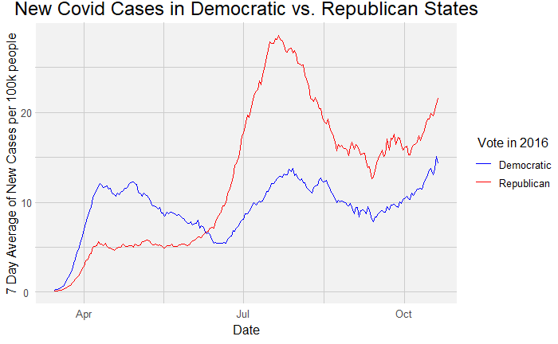
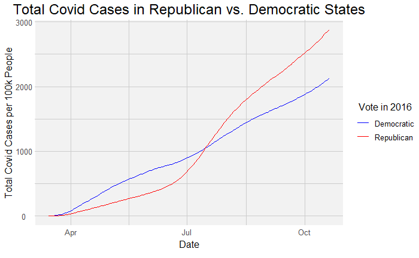
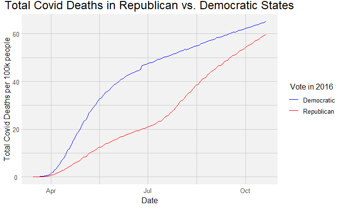
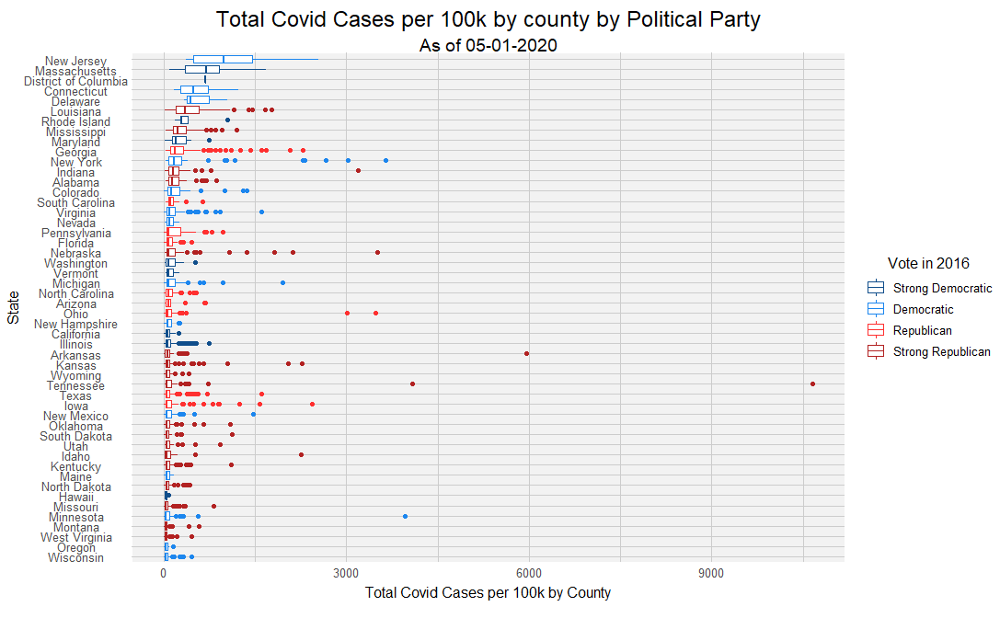
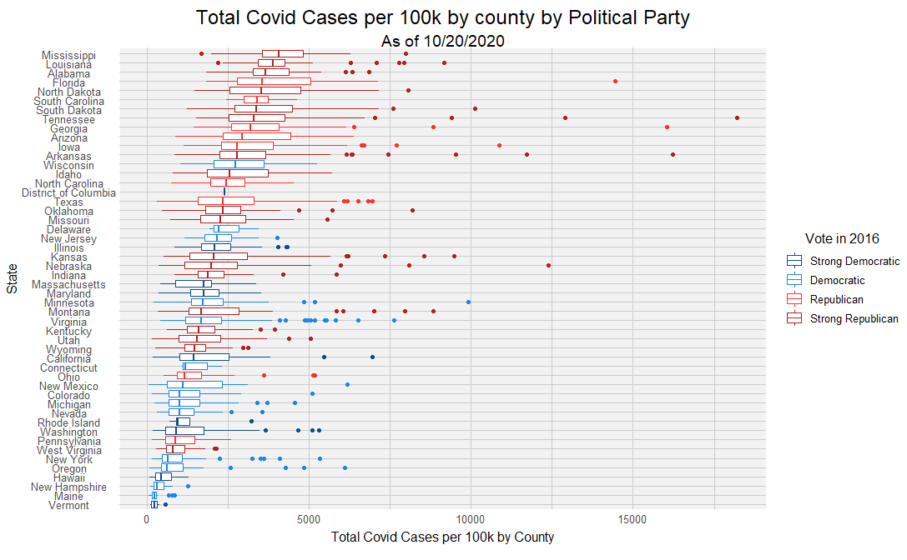

```{r setup, include=FALSE}
knitr::opts_chunk$set(echo = TRUE)
```


**Introduction and Background**

*Note: Due to the complexities of graphing and dependencies and lots of code snippets, we decided to keep our code an report separate. To see the code that generated the graphs, look inside the TimeSeries Line Graph folder, and to see the code that made the animations, look at the Map Notebook folder.*

This year, a virus called COVID-19 began in Wuhan, China. It’s highly contagious characteristic in a globalized world caused it to quickly turn into a global pandemic. Despite its origin being debated and speculated on to this day, it has caused many countries to close their borders and ask their citizens to stay inside, wear masks, and practice “social distancing” - a term that was not used before. This pandemic caused the downfall of many economies, and utter chaos: lack of personal protective equipment for health care workers and citizens, supply chain faults, evictions, and more.

With all of these social implications and an upcoming presidential election in the USA, the COVID-19 virus has been turned into a partisan issue. Each side has taken a strong stance in opposite directions with the people living in democratic or republican areas taking precautions relative to their party. In general, democrats* have been taking a hard stance against the virus: governors closing down their states, enforcing mask mandates, purchasing tests and PPE where possible, etc. Meanwhile, in general, many conservative republicans* have long downplayed the dangers of the virus, refused to change their lifestyles according to the risk. Historically, they have been reluctant to close down state operations and enforce mask-wearing, or even social distancing. Socially, in more democratic* circles people often encourage each other’s quarantines and social distancing, while some republican* circles mock safe COVID-19 practices with “COVID parties”.

In this project, we set out to investigate the relationship between these different partisan approaches to the virus and COVID-19 case numbers. To do this, we categorized states and counties by their 2016 election majorities and compared that against the current COVID-19 numbers in 2020. We recognize that many people’s political affiliations may have changed since then, but that is the most recent voting data that we have access to.

**Our Dataset**
 
The additional dataset that we decided to use comes from townhall.com and includes county-based results of the 2016 election across the US. Townhall is a self-described "leading source for conservative news and political commentary." Based on the initial investigation, I would classify this source as reputable as a standard news reporting website in 2020. Their data collection procedures are not documented on the website that we can find. It is possible that they are not the source of the data, but it is hard to trace back. This data source would probably be considered not reputable for a lot of other analysis and such because it is inherently biased politically. However, because presidential election data results from 2016 have been readily available for a while now, and the results of it are far from a mystery, we can assume that their election results data is reasonably reputable. That being said, especially in recent events, we have seen some manipulation of accepted true data. For this reason, we want to acknowledge that this data source is inherently biased and there is theoretically a potential/motivation to have manipulated results, but we think it is not likely. In terms of unintentional error, some of these counties may have been incorrectly reported, or numbers are estimates, especially for smaller, less connected counties. There do not appear to be any missing counties in this dataset. 

Note that this data set only includes the continental US.
 
**Graphs/Analysis/Conclusions**

First, we wanted to create a graph that illuminated the differences in the number of new cases over seven days of each party. To determine the state party we summed all of the GDP and Dem votes in a state and assigned the party with the majority of votes as the party affiliation. The rolling seven-day average was calculated by summing the new cases per week and then dividing by seven. We determined what was a “new case” by subtracting previous date case counts using lag(). Finally, we normalized the data to account for population differences by dividing by state populations.




Looking at the normalized 7 day average of new cases graph, we initially noticed a few different trends. Initially, Democratic states had more cases per capita, but then republican states surpassed new dem case numbers in June; therefore, we think there may be some correlation between party affiliation and COVID cases per state. Perhaps the logic here is that democratic states tend to be a lot more populated and congested, and since COVID is highly contagious, it makes sense that their numbers spiked first. However, as time normalized the spread of COVID, democratic states often adapted to implement mask mandates and social distancing norms, while many republican states have been reluctant and unwilling to commit to social distancing and a life modified by the virus. While both democratic and republican case numbers spiked in June, new cases spiked significantly more in Republican states, who have historically been more resistant to mask mandates and social distancing practices. As of today, there appear to be about ~35k new cases per day in republican states, and only 22k new cases per day in democratic states.


Now that we have looked at new cases by the week in different states, we want to look deeper into total COVID cases and deaths by state. What follows is two graphs, both normalized per 100k people, the first graph shows the total cases in all democratic versus republican states, and the latter graph shows the same with death numbers.





Looking at the total cases numbers graph, we see the same trend that we saw in the new cases and the seven-day average graph. Initially, there were more cases in democratic states, and then republic case numbers rose rapidly in late June/early July and surpassed the total number of cases in democratic states. However, in the total death graph, we see a new pattern. In the first few months of the pandemic, the democratic state death numbers are skyrocketing compared to those of republican states. Despite the democratic death toll line tending towards a much more leveled out trend in the second half of the pandemic, and republican death tolls trending the opposite way, where they suddenly start rapidly increasing in the later months, republican state death tolls have yet to surpass democratic state death tolls. That being said, they are catching up. Looking at the relative “slopes” of each party’s death tolls going into the current date, the GOP death toll line is tending towards a higher positive slope than the democratic states, indicating that while democratic death tolls are starting to not grow at such an alarming rate (ie, the slope is decreasing over time), GOP states are starting to have death tolls that mirror the slopes that democratic states have previously experienced, and even trend towards surpassing democratic state death tolls.

Now that we have analyzed some of the more overarching trends when comparing all democratic states to all GOP states, we wanted to look a bit more at states and individual entities, comparing how GOP and democratic states compare when each state’s data is kept separate. We created a few new categories of political affiliation to help us do this. For this purpose, we have assigned each state to either a “strong” or a more normal version of its party affiliation. Democratic states were still determined to be democratic if they had more votes for Clinton in the 2016 election, and republican states had more votes for Trump. However, a state was considered a “strong” version of its party affiliation if the split between democrats and republicans was 15% or greater. Again, we have normalized each county's total covid cases to be representative per 100k people. Note: we have decided to use box plots to compare the relative density of different county results within a state.







The first graph of the above was summarizing data towards the beginning of the pandemic (as of 5/1/20), while the latter is for 10/20/20. Looking at the earlier graph, we noticed that the democratic states tend to have a higher mean of cases in their counties than GOP states. However, if we fast forward to the current month, we see the opposite. The top states with the most cases are Republicans and the states with the fewest cases per capita are from democratic leaning states. However, there are some republican states with fewer cases and some democratic states with more cases. Overall, it appears that republican states are currently being hit harder by the pandemic.


**Remaining Questions**

After doing this deep dive into the correlation between political affiliation and COVID case numbers, our remaining questions are about other connected variables that may be affecting the data. We looked at effects on each county and state and their party affiliation, but what if we compared that with when/if each got mask mandates? Would the pattern hold? Additionally, while cases numbers were easy to see correlations with, death numbers were not. We are curious if we were to look at the socioeconomic status that would clarify trends? What if we looked at the mean age of a county (for example, counties with a lot of colleges, versus with primarily elderly residents)? Is that also playing into the correlations we are seeing in our analysis?
