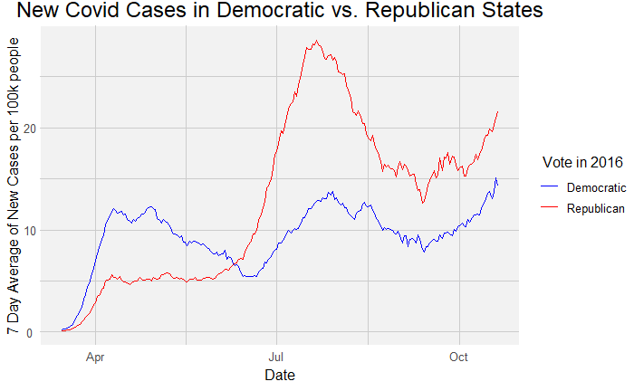
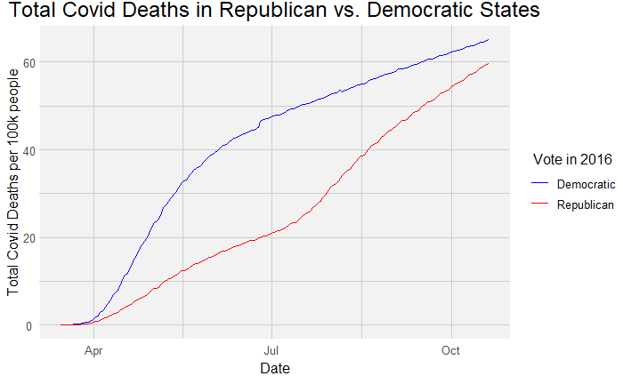
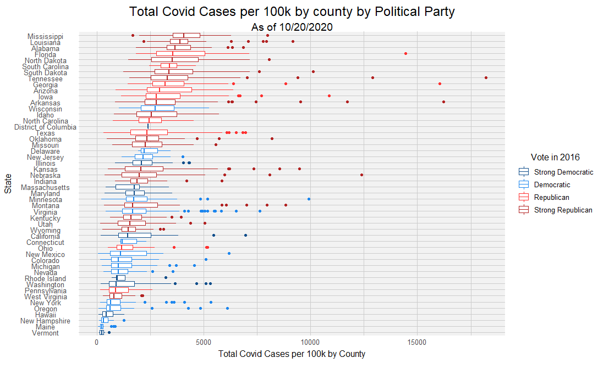

Politics and COVID-19
================
Alpha Group
10/26/2020

**Introduction and Background**

*Note: Due to the complexities of graphing and dependencies and lots of
code snippets, we decided to keep our code an report separate. To see
the code that generated the graphs, look inside the TimeSeries Line
Graph folder, and to see the code that made the animations, look at the
Map Notebook folder.*

This year, a virus called COVID-19 began in Wuhan, China. It’s highly
contagious characteristic in a globalized world caused it to quickly
turn into a global pandemic. Despite its origin being debated and
speculated on to this day, it has caused many countries to close their
borders and ask their citizens to stay inside, wear masks, and practice
“social distancing” - a term that was not used before. This pandemic
caused the downfall of many economies, and utter chaos: lack of personal
protective equipment for health care workers and citizens, supply chain
faults, evictions, and more.

With all of these social implications and an upcoming presidential
election in the USA, the COVID-19 virus has been turned into a partisan
issue. Each side has taken a strong stance in opposite directions with
the people living in democratic or republican areas taking precautions
relative to their party. In general, democrats\* have been taking a hard
stance against the virus: governors closing down their states, enforcing
mask mandates, purchasing tests and PPE where possible, etc. Meanwhile,
in general, many conservative republicans\* have long downplayed the
dangers of the virus, refused to change their lifestyles according to
the risk. Historically, they have been reluctant to close down state
operations and enforce mask-wearing, or even social distancing.
Socially, in more democratic\* circles people often encourage each
other’s quarantines and social distancing, while some republican\*
circles mock safe COVID-19 practices with “COVID parties”.

In this project, we set out to investigate the relationship between
these different partisan approaches to the virus and COVID-19 case
numbers. To do this, we categorized states and counties by their 2016
election majorities and compared that against the current COVID-19
numbers in 2020. We recognize that many people’s political affiliations
may have changed since then, but that is the most recent voting data
that we have access to.

**Our Dataset**

The additional dataset that we decided to use comes from townhall.com
and includes county-based results of the 2016 election across the US.
Townhall is a self-described “leading source for conservative news and
political commentary.” Based on the initial investigation, I would
classify this source as reputable as a standard news reporting website
in 2020. Their data collection procedures are not documented on the
website that we can find. It is possible that they are not the source of
the data, but it is hard to trace back. This data source would probably
be considered not reputable for a lot of other analysis and such because
it is inherently biased politically. However, because presidential
election data results from 2016 have been readily available for a while
now, and the results of it are far from a mystery, we can assume that
their election results data is reasonably reputable. That being said,
especially in recent events, we have seen some manipulation of accepted
true data. For this reason, we want to acknowledge that this data source
is inherently biased and there is theoretically a potential/motivation
to have manipulated results, but we think it is not likely. In terms of
unintentional error, some of these counties may have been incorrectly
reported, or numbers are estimates, especially for smaller, less
connected counties. There do not appear to be any missing counties in
this dataset.

Note that this data set only includes the continental US.

**Graphs/Analysis/Conclusions**

First, we wanted to create a graph that illuminated the differences in
the number of new cases over seven days of each party. To determine the
state party we summed all of the GDP and Dem votes in a state and
assigned the party with the majority of votes as the party affiliation.
The rolling seven-day average was calculated by summing the new cases
per week and then dividing by seven. We determined what was a “new case”
by subtracting previous date case counts using lag(). Finally, we
normalized the data to account for population differences by dividing by
state populations.

Looking at the normalized 7 day average of new cases graph, we initially
noticed a few different trends. Initially, Democratic states had more
cases per capita, but then republican states surpassed new dem case
numbers in June; therefore, we think there may be some correlation
between party affiliation and COVID cases per state. Perhaps the logic
here is that democratic states tend to be a lot more populated and
congested, and since COVID is highly contagious, it makes sense that
their numbers spiked first. However, as time normalized the spread of
COVID, democratic states often adapted to implement mask mandates and
social distancing norms, while many republican states have been
reluctant and unwilling to commit to social distancing and a life
modified by the virus. While both democratic and republican case numbers
spiked in June, new cases spiked significantly more in Republican
states, who have historically been more resistant to mask mandates and
social distancing practices. As of today, there appear to be about \~35k
new cases per day in republican states, and only 22k new cases per day
in democratic states.

Now that we have looked at new cases by the week in different states, we
want to look deeper into total COVID cases and deaths by state. What
follows is two graphs, both normalized per 100k people, the first graph
shows the total cases in all democratic versus republican states, and
the latter graph shows the same with death numbers.

Looking at the total cases numbers graph, we see the same trend that we
saw in the new cases and the seven-day average graph. Initially, there
were more cases in democratic states, and then republic case numbers
rose rapidly in late June/early July and surpassed the total number of
cases in democratic states. However, in the total death graph, we see a
new pattern. In the first few months of the pandemic, the democratic
state death numbers are skyrocketing compared to those of republican
states. Despite the democratic death toll line tending towards a much
more leveled out trend in the second half of the pandemic, and
republican death tolls trending the opposite way, where they suddenly
start rapidly increasing in the later months, republican state death
tolls have yet to surpass democratic state death tolls. That being said,
they are catching up. Looking at the relative “slopes” of each party’s
death tolls going into the current date, the GOP death toll line is
tending towards a higher positive slope than the democratic states,
indicating that while democratic death tolls are starting to not grow at
such an alarming rate (ie, the slope is decreasing over time), GOP
states are starting to have death tolls that mirror the slopes that
democratic states have previously experienced, and even trend towards
surpassing democratic state death tolls.

Now that we have analyzed some of the more overarching trends when
comparing all democratic states to all GOP states, we wanted to look a
bit more at states and individual entities, comparing how GOP and
democratic states compare when each state’s data is kept separate. We
created a few new categories of political affiliation to help us do
this. For this purpose, we have assigned each state to either a “strong”
or a more normal version of its party affiliation. Democratic states
were still determined to be democratic if they had more votes for
Clinton in the 2016 election, and republican states had more votes for
Trump. However, a state was considered a “strong” version of its party
affiliation if the split between democrats and republicans was 15% or
greater. Again, we have normalized each county’s total covid cases to be
representative per 100k people. Note: we have decided to use box plots
to compare the relative density of different county results within a
state.

The first graph of the above was summarizing data towards the beginning
of the pandemic (as of 5/1/20), while the latter is for 10/20/20.
Looking at the earlier graph, we noticed that the democratic states tend
to have a higher mean of cases in their counties than GOP states.
However, if we fast forward to the current month, we see the opposite.
The top states with the most cases are Republicans and the states with
the fewest cases per capita are from democratic leaning states. However,
there are some republican states with fewer cases and some democratic
states with more cases. Overall, it appears that republican states are
currently being hit harder by the pandemic.

**Remaining Questions**

After doing this deep dive into the correlation between political
affiliation and COVID case numbers, our remaining questions are about
other connected variables that may be affecting the data. We looked at
effects on each county and state and their party affiliation, but what
if we compared that with when/if each got mask mandates? Would the
pattern hold? Additionally, while cases numbers were easy to see
correlations with, death numbers were not. We are curious if we were to
look at the socioeconomic status that would clarify trends? What if we
looked at the mean age of a county (for example, counties with a lot of
colleges, versus with primarily elderly residents)? Is that also playing
into the correlations we are seeing in our analysis?
